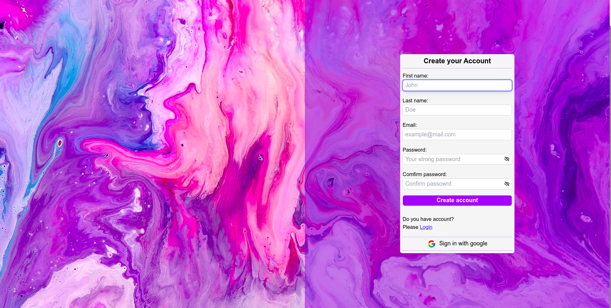
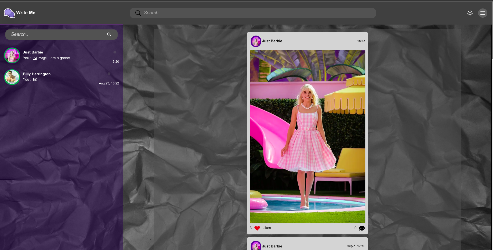
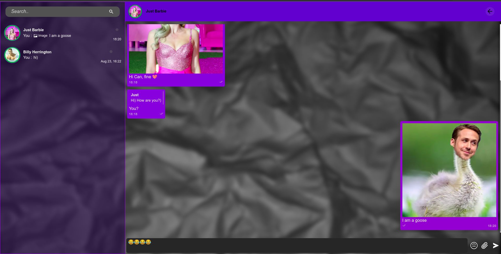
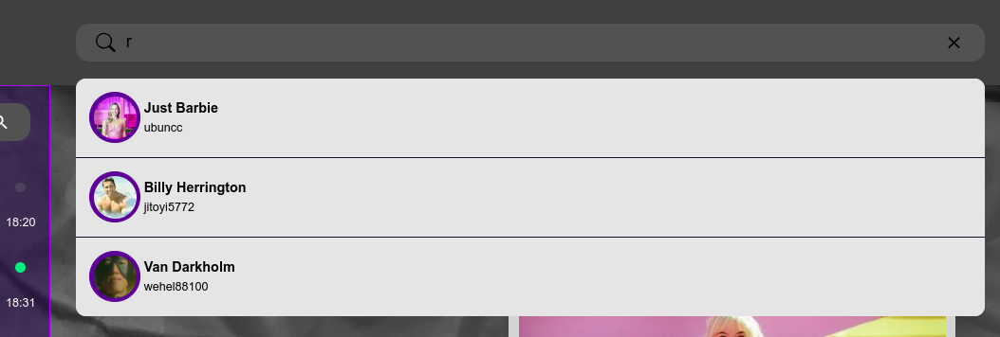
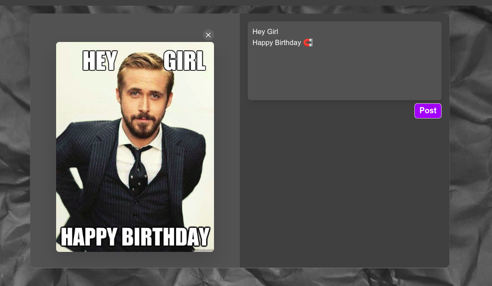

# Live chat
## Simple simple social network

### Description
Chat in which users can communicate in real time, share photos, view the network status of friends (online/offline), see when the person is typing a message and whether he read your message and much more.

Users can also add to their own
account posts (currently only photos)

### Screenshots

#### Registration page

#### Home page

#### Chat page

#### Search users

#### Add post

## Project Scope
 
- [X] Reply to a specific message 
- [X] Send images to chat
- [X] Deleting messages
- [X] User online status
- [X] Show when the other person is typing a message
- [X] New message notification
- [X] Update user profile

## Nice to have

- [ ] User subscriptions
- [ ] Сomments under posts
- [ ] Adding videos to posts

## Dependencies

### Client
 - [Next.js](https://nextjs.org/blog/next-13)
 - [tailwindcss](https://tailwindcss.com/)
 - [React Hook Form](https://react-hook-form.com/)
 - [TanStack Query](https://tanstack.com/query/v3/)
 - [Zustand](https://github.com/pmndrs/zustand)
 - [React Icons](https://react-icons.github.io/react-icons/)
 - [Emoji Mart](https://missiveapp.com/open/emoji-mart)
 - [Firebase](https://firebase.google.com/docs/web/setup)
 - [React-Toastify](https://github.com/fkhadra/react-toastify#readme)
 - [Socket.io Client](https://socket.io/docs/v4/client-installation/)

### Server
 - [Express](https://expressjs.com/)
 - [Firebase Admin](https://github.com/firebase/firebase-admin-node)
 - [Google Cloud Storage](https://www.npmjs.com/package/@google-cloud/storage)
 - [Socket.io](https://socket.io/)
 - [Multer](https://www.npmjs.com/package/multer)
 - [Prisma.io](https://www.prisma.io/)
 - [Redis](https://www.npmjs.com/package/redis)

### Database

- [PostgreSQL](https://www.postgresql.org/)
- [Redis](https://redis.io/)
